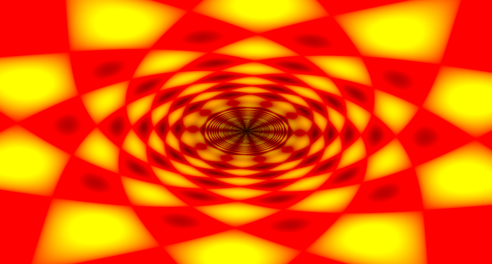

# pilka 🔩 (WIP)



Available features:
 
- [X] Hot-reload
- [X] Saving shaders
- [X] Taking screenshot
- [ ] Record video

Pilka is a cross-platform democoding tool for creating shader* demos,
similar to [Bonzomatic](https://github.com/Gargaj/Bonzomatic) or [KodeLife](https://hexler.net/products/kodelife). Supports hot-reloading which means
resources is checked, updated in the background.

## Controls

- `F1`:   Toggles play/pause
- `F2`:   Pauses and steps back one frame
- `F3`:   Pauses and steps forward one frame
- `F4`:   Restarts playback at frame 0 (`Time` and `Pos` = 0)
- `F10`:  Save shaders
- `F11`:  Take Screenshot
- `F12`:  Start/Stop record video
- `ESC`:  Exit the application
- Arrows: Change `Pos`

## Parameters

(per-draw-update)

- position: vec3
- time: float
- resolution: vec2
- mouse: vec2

## Requirements

Vulkan SDK is required.

## Installation

```Bash
cargo install pilka
```

You also can install the application by to downloading the source code
and build locally.

```Bash
# or through ssh git@github.com:pudnax/pilka.git
git clone https://github.com/pudnax/pilka.git
cd pilka
cargo install --path .
```

Places from where i steal code:

- [piet-gpu](https://github.com/linebender/piet-gpu)
- [Aetna's tutorial](https://hoj-senna.github.io/ashen-aetna/)
- https://github.com/w23/OpenSource
