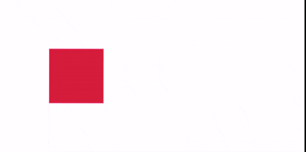
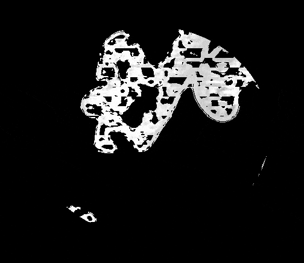
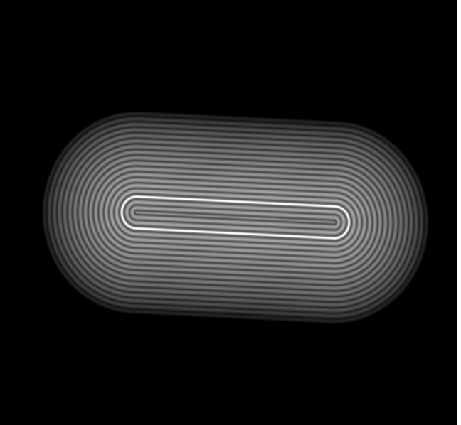
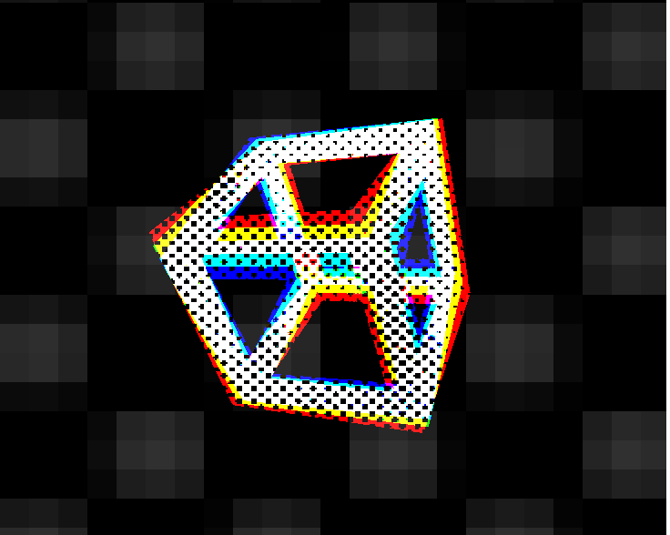
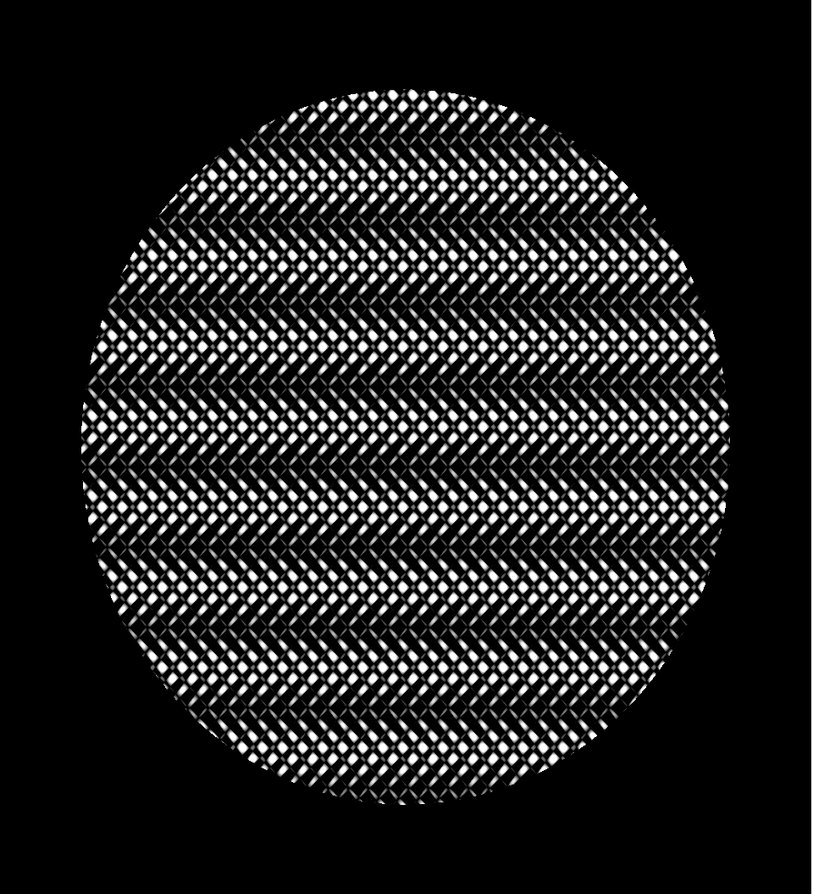
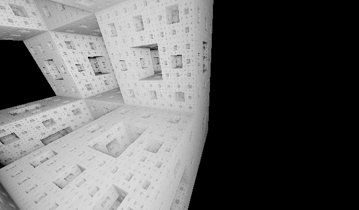
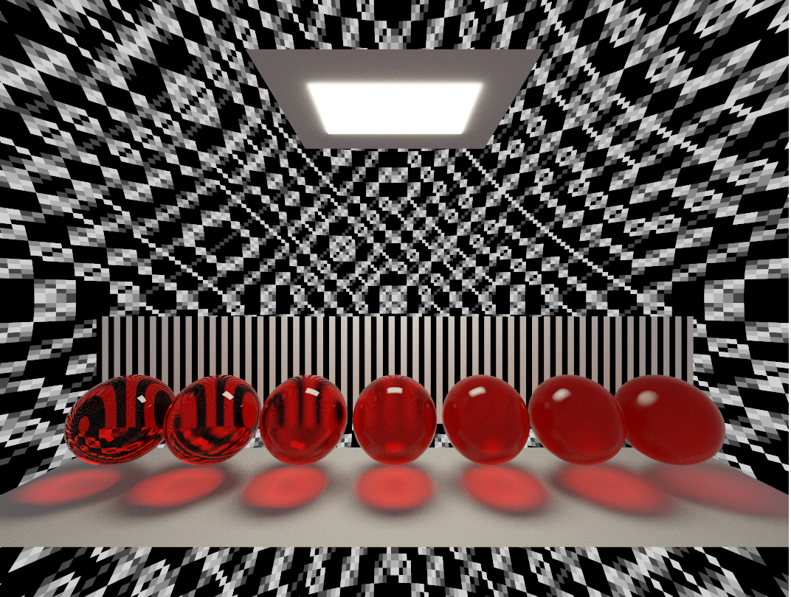
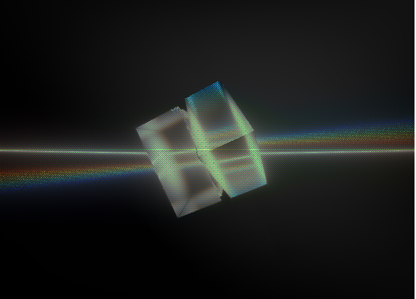
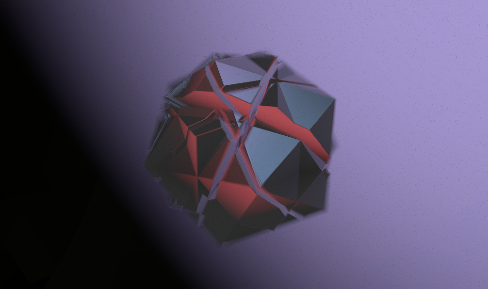

# pilka 🔩

[](https://crates.io/crates/pilka)

Pilka is a cross-platform live-coding tool for creating shader\* demos,
similar to [Bonzomatic](https://github.com/Gargaj/Bonzomatic) or [KodeLife](https://hexler.net/products/kodelife). Supports hot-reloading, which means
resources is checked and updated in the background.

Available features:

- [x] Hot-reload
- [x] Saving shaders
- [x] Taking screenshot
- [x] Record video
- [x] Compute pipeline for post processing


## How

In current state `pilka` tries to seek `shaders` folder with the files
`shader.vert` and `shader.frag`, on fail `pilka` will generate
default setup for you. Then open shader in your favourite code editor (VS,
emacs, vim, ed etc.) and `pilka` would fetch changes after each save.

## Controls

- <kbd>F1</kbd>: Print help
- <kbd>F2</kbd>: Toggle play/pause
- <kbd>F3</kbd>: Pause and step back one frame
- <kbd>F4</kbd>: Pause and step forward one frame
- <kbd>F5</kbd>: Restart playback at frame 0 (`Time` and `Pos` = 0)
- <kbd>F6</kbd>: Print parameters
- <kbd>F10</kbd>: Save shaders
- <kbd>F11</kbd>: Take Screenshot
- <kbd>F12</kbd>: Start/Stop record video
- <kbd>ESC</kbd>: Exit the application
- <kbd>Arrows</kbd>: Change `Pos`

## Parameters

(per-draw-update)

| name          | type    | range   |
| ------------- | ------- | ------- |
| position      | vec3    | (-∞, ∞) |
| time          | float   | [0, ∞)  |
| resolution    | vec2    | [0, a]  |
| mouse         | vec2    | [-1, 1] |
| mouse_pressed | bool    |         |
| frame         | uint    |         |
| time_delta    | float   |         |
| prev_frame    | texture |         |

## Flags

 - `--record f32` - Start video record
 - `--size f32xf32` - specify window size and locks window from resizing

## Requirements

Vulkan SDK is required.

On recent macOS, to allow sound input to be captured (for FFT textures to
be generated), you need to: Open up System Preferences, click on Security
& Privacy, click on the Privacy tab then click on the Microphone menu item.
Make sure `pilka` is in the list and ticked...
erm, probably. I don't have macOS.

## Installation

```Bash
cargo install pilka
```

You also can install the application by to downloading the source code
and build locally.

```Bash
# or through ssh git@github.com:pudnax/pilka.git
git clone https://github.com/pudnax/pilka.git
cd pilka
cargo install --path .
```

## Dependencies

[winit](https://crates.io/crates/winit) is the "default" window library in Rust ecosystem. And it covers
the most of cross-platform issues for you.

[RustFFT](https://crates.io/crates/rustfft) is used to perform Fast FFT for generating sound textures.

[cpal](https://crates.io/crates/cpal) is used to capture sound from microphone and probably MIDI devices
in the future.

[png](https://crates.io/crates/png) is used to encode screenshots into png files.

[notify](https://crates.io/crates/notify) is a file watcher and maintains the hot-reload.

[shaderc](https://crates.io/crates/shaderc) is used to compile GLSL shaders on the runtime instead of opening
a process with glslc or glslangValidator. I hope to switch to [naga](https://crates.io/crates/naga) soon,
when it's mature enough.

[ash](https://crates.io/crates/ash) is a Vulkan bindings. I choose `ash` because I see `pilka` as a
learning project and want to touch the maximum untouched Vulkan. For the
same reason I didn't use `vulkano`, `erupt`, `vulkanism`, `vkvk` and `wgpu`.

**Ffmpeg** is used to record and save to video. For my concerns it's
temporary solution after which I switch to [rav1e](https://github.com/xiph/rav1e) on it's release.

### Places of inspiration (from where I steal code):

- [piet-gpu](https://github.com/linebender/piet-gpu)
- https://github.com/w23/OpenSource

## Examples
You can run any example by executing `pilka` inside of the folder
```bash
cd examples/dithering
cargo run
```

| cube                                                | cellular automata                                               | line segment                                      |
|-----------------------------------------------------|-----------------------------------------------------------------|---------------------------------------------------|
|                    |  |  |
| dithering                                           | circle pattern                                                  | menger sponge                                     |
|     |         |    |
| path tracer                                         | lasers                                                          | oblique slices                                    |
|    |                            |            |
